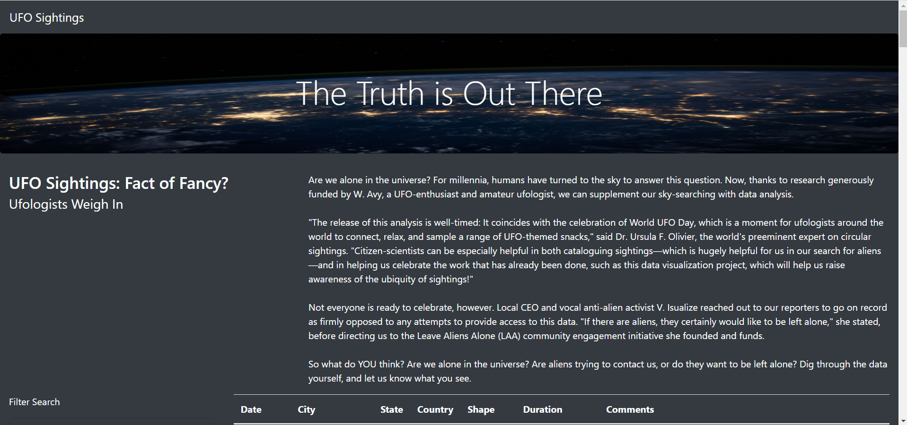
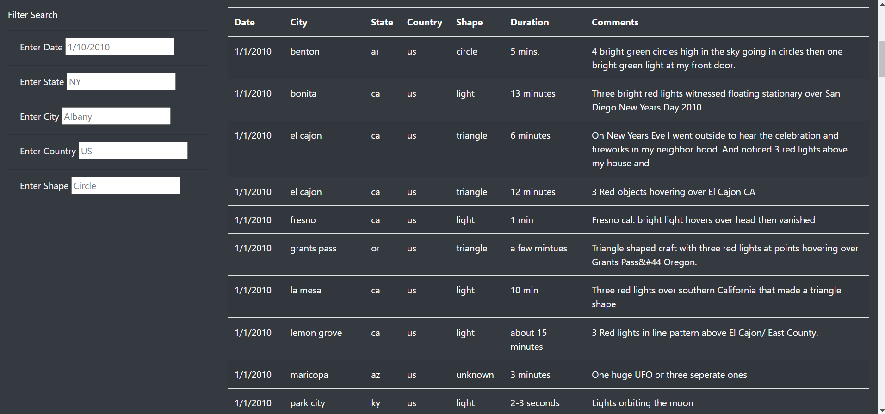
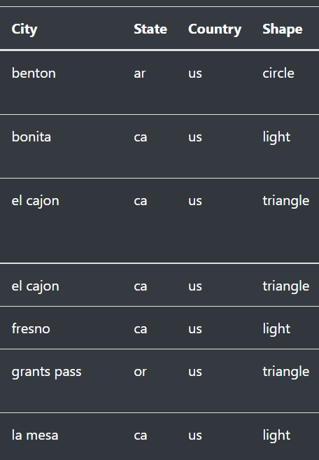

# UFO_Sightings
Utilize JavaScript, Bootstrap, HTML and CSS to build a customized dynamic website.

# Resources
Data Sources: 
data.ds

### Overview of Project
Using the UFO sighting data that is stored as a JavaScript array, a table was built within a dynamic website. The table is customized for user input, allowing for filters to be applied to the table. Users can filter the UFO sighting data by country, state, city, and shape of UFO. JavaScript was used build the table while Bootstrap, HTML and CSS were used to customize the appearance of the website.

### Results
When the webpage first loads, users will see the title in the jumbotron. The webpage was built to be sleek and dark toned to match the eerie quality of the UFO sightings. The article was included in the middle right side of the page with the title on the left. As the user continues to scroll down, the table of data is displayed with the filter box on the left-hand side labelled "filter search"
 

Within the 'Filter Search' box, various filters can be seen. Here the user is able to input a country, city, state, date, and shape. If the search provides results, the user is provided with different data regarding that sighting such as; date, city, state, country, shape, duration and comments describing the sighting. Placeholders were used to give users a general idea of what information to input. Once the user inputs the filter they want, they just press enter and the data will filter accordingly.

### Summary
The dynamic website looks sleek and is relatively easy when it comes to user interaction. The light text with the dark background makes the information pop and catches the attention of the reader. The multiple filters allow for the uder to search for different information within the data. The overview at the beginning of the website gives the user an good idea as to what the webpage is about.
There are a few areas in which the website can be improved. To begin with, the data is slightly messy as there is missing capitalization for the city, state, country and shape. If the user were to search for "La Mesa" rather than "la mesa", the results would not show for the users because the city is not capitalized in the data array. This is something that should be kept in mind, not only to keep the webpage looking more professional, but also to be uniform throughout and prevent easy errors. The filter button could also still be included at the bottom so long as it filters the data correctly. Having the user hit "enter" rather than having a button to click may cause some confusion for users that are less accustomed to using the computer. 

 

Dana could also include tabs within her webpage to allow for things like resources, contact information, recent articles, and even an area for users to input their own sightings. Overall, this interact webpage has a lot of potential and with some extra customization could be a userful tool for those intererested in the extraterrestrial. 
